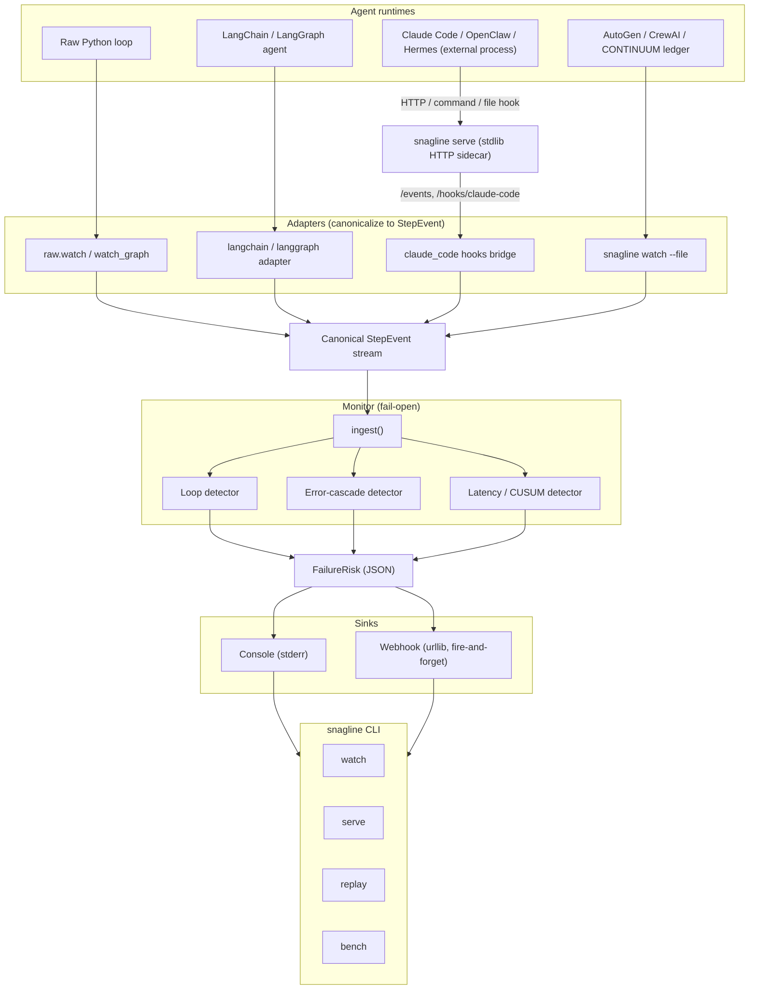

# SNAGLINE

**Lightweight, dependency-free companion library that watches any agent's
execution stream and flags loops and error cascades in real time.** It is cheap
enough to run on every step of a week-long unattended run, with a hard
fail-open guarantee so it can never crash or stall the agent it monitors.

Current build phase: v0.1+. Core detectors (loop, error cascade, latency/CUSUM),
console + webhook sinks, `raw` / LangChain / LangGraph adapters, a stdlib HTTP
sidecar for non-Python agents, and `watch` / `serve` / `replay` / `bench` CLIs
are implemented and tested. The Claude Code hooks bridge and the
framework-bridge docs (`docs/FRAMEWORK_BRIDGES.md`) are implemented. The
optional ML/goal-drift extras and the demand-driven adapters (AutoGen, CrewAI)
are explicitly out of scope until they have a verified upstream API or real
demand (see `project.md` §13).

## Verification status

These numbers are measured, not asserted. Run them yourself to reproduce.

```
tests : 76 passed, 1 skipped  (pytest, Python 3.14.5, 2026-08-15)
bench : median 1.05 us/step, p99 1.14 us/step over 200,000 synthetic steps
        (measured 2026-08-15 on Apple M1, arm64, CPython 3.14.5)
```

## Architecture



The diagram shows the three layers: agent runtimes feed adapters that
canonicalize every step into a `StepEvent`; the `Monitor` runs the deterministic
detectors and emits `FailureRisk` JSON; sinks deliver alerts. External,
non-Python agents bridge in through the stdlib sidecar over HTTP, command, or
file, so the same detector core serves every runtime.

## What it detects

- **Loops** - the same logical action repeating `N` times within a sliding
  window (catches retry storms and stuck agents).
- **Error cascades** - `N` consecutive errors, or `N` errors within a recent
  window (catches both fast and slow-burn failures).
- **Latency anomalies** - a sustained deviation of a tool's `latency_ms` from
  its own running baseline, via a Welford/CUSUM statistic (stdlib only, no
  numpy). A short warm-up learns the baseline before any alarm can fire, so
  normal run-to-run jitter does not produce false positives.

Detection is deterministic and `O(1)` amortized per step. It runs with no
network calls and no LLM calls.

## What it does NOT do (explicit non-goals)

- **No goal-drift detection** - that needs embeddings and is a real
  dependency; planned for v2 at earliest.
- **No automatic repair** - detection and escalation only. Repair is a
  distinct, harder problem.
- **No claim to beat a reference statistical ensemble.** v1 uses
  deterministic detectors; a statistical ensemble is an optional later extra.
  No detection-accuracy number is claimed here until it has been measured
  honestly.
- **Not a replacement for human review** on high-stakes actions - it is a cheap
  first-pass signal that routes to existing escalation paths.

## Relationship to CONTINUUM

SNAGLINE is a **separate project**, not a module inside CONTINUUM. It is
framework-agnostic: it ingests a canonical `StepEvent` stream from any agent
runtime (a raw Python loop, LangChain, LangGraph, AutoGen, CrewAI, or
CONTINUUM's ledger). Keeping it separate preserves CONTINUUM's zero-dependency
guarantee and makes the tool adoptable by anyone running agents, not only
CONTINUUM users.

## Privacy

Detectors reason only about **hashes, timings, counts, and booleans** - never
raw prompt or response content. `action_signature` is a one-way SHA-256 digest,
and the `FailureRisk` payload a sink receives deliberately carries no
`metadata` field, so an alerting channel (webhook, Slack) cannot become an
accidental data-exfiltration path.

## Install

Core has **zero third-party dependencies** and works on Python 3.10+:

```
pip install .
```

(Extension extras like `[langchain]`, `[ml]`, `[slack]` are optional and add
dependencies only when you opt in.)

## Quick start (raw loop)

```python
from snagline import Monitor
from snagline.adapters.raw import watch

monitor = Monitor.default()  # loop + error-cascade detectors, console sink
with watch(monitor, "ep-1") as step:
    step("tool_call", tool_name="search", args="query", latency_ms=120, error=False)
    # ... your agent loop body ...
```

Any detected failure is printed as a JSON line to stderr, e.g.:

```json
{"episode_id": "ep-1", "step_id": "3", "score": 0.5, "trigger": "loop", "detail": "action repeated 3x in last 4 steps", "timestamp": 1718300000.0}
```

(The `timestamp` is the wall-clock time `ingest()` was called; the example
above is illustrative.)

See `examples/raw_loop_example.py` for a runnable end-to-end example. The
`--healthy` flag runs a clean trajectory with no detections:

```
PYTHONPATH=src python3 examples/raw_loop_example.py --healthy
# [demo] finished healthy (expect no detections); see stderr above for any FailureRisk lines.
```

## Validation — proven on a real LLM

SNAGLINE is not just unit-tested: it has been run against a **real language
model** (live `create_agent` + real tools) with its full pipeline — adapter →
detectors → `WebhookSink` → HTTP sidecar — and it detected **real loops, real
error cascades, and real latency anomalies**, all shipped over real HTTP.
Verbatim evidence and a copy-paste reproduction are in
[`docs/REAL_WORLD_PROOF.md`](docs/REAL_WORLD_PROOF.md) (includes a no-key path
and a real-LLM path via OpenRouter/OpenAI/Anthropic).

## Runnable examples

All examples live under `examples/` and run against the source tree with
`PYTHONPATH=src`:

```
# Plain agent loop (the `raw` adapter); shows loop + error-cascade + latency risks
PYTHONPATH=src python3 examples/raw_loop_example.py --healthy   # clean run, no risks

# Offline trajectory replay (loop + error-cascade + latency)
PYTHONPATH=src python3 examples/replay_offline_trajectory.py

# Real LangChain run via the callback handler (requires the langchain extra)
pip install snagline-agent[langchain]
PYTHONPATH=src python3 examples/langchain_example.py            # repeated prompt -> loop

# Real-framework chaos harness: prove each detector fires on a genuine
# LangChain agent loop (no API key required; uses a real langchain_core Tool
# + callback path, with a scripted fake model). One mode per detector:
PYTHONPATH=src python3 examples/real_agent_demo.py --mode healthy   # expect SILENCE
PYTHONPATH=src python3 examples/real_agent_demo.py --mode loop      # loop
PYTHONPATH=src python3 examples/real_agent_demo.py --mode error     # error_cascade
PYTHONPATH=src python3 examples/real_agent_demo.py --mode latency   # latency_anomaly
# With OPENAI_API_KEY / ANTHROPIC_API_KEY + the matching package installed, the
# healthy run uses a REAL chat model as a false-positive check.
```

The same chaos scenarios, but driven through a **real LangChain 1.x
`create_agent` agent** (a LangGraph `CompiledStateGraph`) instead of a hand-rolled
loop, so the adapter is proven against the actual framework:

```
pip install langchain snagline-agent[langchain]
PYTHONPATH=src python3 examples/real_agent_executor_demo.py --mode loop
PYTHONPATH=src python3 examples/real_agent_executor_demo.py --mode error
PYTHONPATH=src python3 examples/real_agent_executor_demo.py --mode latency
PYTHONPATH=src python3 examples/real_agent_executor_demo.py --mode healthy
```

### Real LLM, real time (OpenRouter / OpenAI / Anthropic)

`examples/real_time_llm_demo.py` attaches SNAGLINE to a genuine `create_agent`
run backed by a **real chat model** and **real tools**, so detections stream
out as the model drives tools. Modes: `healthy` (should be silent,
false-positive check), `error` (a tool that raises on every call,
`error_cascade`), `latency` (one tool with variable latency,
`latency_anomaly`).

OpenRouter serves an OpenAI-compatible API with free models, no paid key
needed. The key is read from `OPENAI_API_KEY` at runtime and never written to
disk by the script:

```
export OPENAI_API_KEY=sk-or-...
PYTHONPATH=src python3 examples/real_time_llm_demo.py \
    --provider openai --base-url https://openrouter.ai/api/v1 \
    --model openai/gpt-oss-20b:free --mode error
```

Note: free-tier models are often rate-limited or return transient `502`s.
SNAGLINE correctly flags repeated model failures as an `error_cascade`. For a
stable `healthy` = silent run, use a reliable model.

### Webhook sink → HTTP sidecar (real-time, end-to-end)

`examples/real_time_webhook_demo.py` closes the loop on the NEW webhook sink
and HTTP sidecar with **real detection** (nothing faked): a genuine
`create_agent` run drives a real failing tool, the real `ErrorCascadeDetector`
fires, and a `WebhookSink` POSTs that real `FailureRisk` over HTTP to the
sidecar's `POST /risks` endpoint, which receives and prints it live.

Full reproducible walkthrough plus verbatim evidence from a ~5-minute live run:
[`docs/REAL_WORLD_PROOF.md`](docs/REAL_WORLD_PROOF.md).

```
# terminal 1: the sidecar (receives risks at POST /risks)
snagline serve --port 8787
# (or without installing the console script:
#  PYTHONPATH=src python -c "from snagline import Monitor; \
#    from snagline.server.http_server import serve; \
#    serve(Monitor.default(), host='127.0.0.1', port=8787)")
# terminal 2: real LLM -> real detector -> WebhookSink -> sidecar
export OPENAI_API_KEY=sk-or-...
PYTHONPATH=src python3 examples/real_time_webhook_demo.py \
    --provider openai --base-url https://openrouter.ai/api/v1 \
    --model openai/gpt-oss-20b:free --mode error
# terminal 1 prints: [sidecar] RECEIVED risk -> trigger=error_cascade ...
```

The sidecar also accepts canonical `StepEvent`s at `POST /events` (any runtime
can POST them) and detects locally; see `docs/FRAMEWORK_BRIDGES.md`.

## LangGraph adapter

For code that consumes `graph.stream(...)` directly (LangGraph's default
`updates` mode), `watch_graph` is a pass-through iterator that monitors as it
yields, a one-line change to the host code:

```python
from snagline import Monitor
from snagline.adapters.langgraph_adapter import watch_graph

monitor = Monitor.default()
for update in watch_graph(monitor, "ep-1", graph.stream(inputs)):
    ...  # your normal stream consumption, unchanged
```

Node name maps to `tool_name`, time between superstep yields maps to
`latency_ms`, a node update carrying an `error` key (or an exception) maps to
`error=True`, and the signature hashes the node name plus the update's shape so
a node repeatedly failing the same way is loop-detectable.

## Sinks

- **Console** (default): `FailureRisk` as a JSON line on stderr.
- **Webhook**: `WebhookSink(url)` POSTs the same JSON via stdlib
  `urllib.request`, fire-and-forget with a short timeout, never blocks
  `ingest()`, silently ignores a dead endpoint. Only `FailureRisk` fields are
  ever transmitted (no `StepEvent.metadata`), so an alerting channel can't
  become an accidental data-exfiltration path.

## Sidecar server (non-Python agents)

Any runtime, TypeScript, Node, a Claude Code hook script, can POST events to
a stdlib-only sidecar:

```
snagline serve --host 127.0.0.1 --port 8787
# POST /events              body: StepEvent JSON   -> 202, ingested
# POST /hooks/claude-code   body: native Claude Code hook payload -> 202, mapped + ingested
# GET  /health                                     -> 200
```

Verified live (2026-08-15): `GET /health` returns `200`; `POST /events` with a
`StepEvent` returns `202`; `POST /hooks/claude-code` with a native hook payload
returns `202` and is mapped into the detector stream.

## Live watch mode

`snagline watch` reads StepEvent JSON lines from stdin and ingests them as
they arrive (e.g. `tail -f agent_events.jsonl | snagline watch`), with optional
webhook escalation:

```
snagline watch --sink webhook --webhook-url https://hooks.example/alerts
```

Verified live: feeding three repeated `StepEvent` lines through `snagline watch`
emits a `loop` `FailureRisk` and reports `ingested 3 step(s)`.

## Connecting external agent processes (Claude Code, OpenClaw, Hermes, ...)

Claude Code, OpenClaw, and Hermes are processes, not Python libraries, so
SNAGLINE bridges at the process level with three universal mechanisms, HTTP,
command, and file, documented with copy-paste wiring for each framework in
`docs/FRAMEWORK_BRIDGES.md`. The short version:

```
# start the receiver once (stdlib only)
snagline serve --port 8787

# Claude Code: add a native http hook to .claude/settings.json
#   { "type": "http", "url": "http://127.0.0.1:8787/hooks/claude-code" }
# -> SNAGLINE maps the native hook payload itself: tool loops, error
#    cascades (PostToolUseFailure), and latency (Pre/Post paired by
#    tool_use_id) are detected with zero glue code.
```

Verified live (2026-08-15): posting five `PostToolUseFailure` Claude Code hook
payloads (same `tool_name`, distinct `tool_use_id`) to `/hooks/claude-code`
produced both a `loop` and an `error_cascade` `FailureRisk`:

```json
{"episode_id": "sess-abc", "step_id": "call-5", "score": 0.8333333333333334, "trigger": "loop", "detail": "action repeated 5x in last 5 steps", "timestamp": 1786769090.730109}
{"episode_id": "sess-abc", "step_id": "call-5", "score": 0.8, "trigger": "error_cascade", "detail": "5 consecutive errors", "timestamp": 1786769090.730109}
```

```
# any shell-capable framework: pipe any hook payload through the bridge
some-hook-event.json | snagline hook --url http://127.0.0.1:8787/events

# any framework that can only append to a file
snagline watch --file /var/log/agent/events.jsonl --follow
```

`snagline hook` always exits 0 and never blocks, so a monitoring bridge can
never break the agent it monitors.

## Extending

- `docs/ADAPTER_GUIDE.md` - wire any framework into SNAGLINE in an afternoon.
- `docs/DETECTOR_GUIDE.md` - the detector contract, constraints, and test shape.
- `docs/FRAMEWORK_BRIDGES.md` - connect external agent processes (Claude Code,
  OpenClaw, Hermes) via HTTP, command, or file bridges.

## Replay (offline analysis)

The same detectors run over an exported trajectory file:

```
snagline replay trajectory.jsonl --summary
```

Each line must be a JSON object with the `StepEvent` fields (see
`tests/fixtures/trajectories/` for worked examples, including an injected loop,
an injected error cascade, and an injected latency spike). Verified live
(2026-08-15):

```
snagline replay tests/fixtures/trajectories/injected_loop.jsonl --summary
# replayed 24 steps; 2 risk(s) emitted   -> 2 loop FailureRisk lines

snagline replay tests/fixtures/trajectories/injected_error_cascade.jsonl --summary
# replayed 24 steps; 2 risk(s) emitted   -> 2 error_cascade FailureRisk lines

snagline replay tests/fixtures/trajectories/injected_latency_spike.jsonl --summary
# replayed 52 steps; 12 risk(s) emitted  -> 12 latency_anomaly FailureRisk lines
```

## Overhead

`ingest()` is cheap enough to run on every step of a long unattended run. The
claim is measured, not asserted. `benchmarks/overhead_benchmark.py` (run via
`snagline bench`) times `Monitor.ingest()` over 200,000 synthetic steps. Real
measured result (2026-08-15, Apple M1 arm64, CPython 3.14.5):

```
median 1.05 us/step, p99 1.14 us/step   (run `snagline bench` to reproduce on yours)
```

This is comfortably under the sub-100-microsecond per-step target.

## Fail-open guarantee

If a detector or sink raises, the exception is caught and logged, never
propagated into the host agent. Set `fail_open=False` only when you want strict
behavior (e.g. tests). This property is covered by `tests/test_monitor_fail_open.py`.

## License

MIT.
