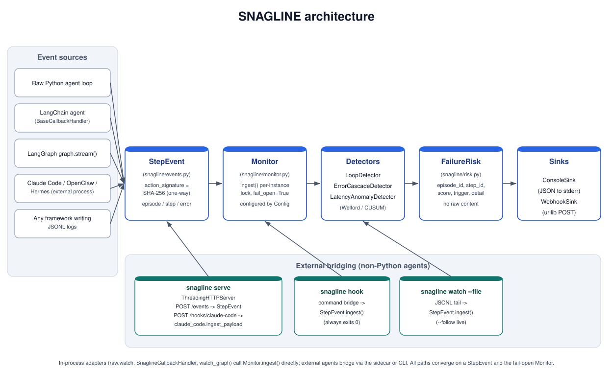

<p align="center">
  
</p>

<p align="center">
  <strong>SNAGLINE: Lightweight, dependency-free real-time failure detection for AI agents.</strong><br/>
  Watches any agent's execution stream, flags loops, error cascades, and latency
  anomalies in real time, cheaply enough to run on every step of a week-long
  unattended run. Hard fail-open guarantee: it can never crash or stall the
  agent it monitors.
</p>

<p align="center">
  <a href="https://www.python.org/downloads/"></a>
  <a href="LICENSE"></a>
  <a href="https://github.com/Cyrax321/SNAGLINE/issues"></a>
  <a href="https://github.com/Cyrax321/SNAGLINE/actions"></a>
</p>

---

## Contents

[Why](#why) · [Quick Start](#quick-start) · [How it works](#how-it-works) · [What it detects](#what-it-detects) · [Features](#features) · [Configuration](#configuration) · [Empirical Verification](#empirical-verification) · [Framework Integration](#framework-integration) · [Sinks](#sinks) · [External Agent Bridges](#external-agent-bridges) · [Core Concepts](#core-concepts) · [Architecture](#architecture) · [API and CLI](#api-and-cli) · [Security and Privacy](#security-and-privacy) · [What SNAGLINE Is Not](#what-snagline-is-not) · [Relationship to CONTINUUM](#relationship-to-continuum) · [Related Work](#related-work) · [Roadmap](#roadmap) · [Status and Limitations](#status-and-limitations) · [Contributing](#contributing) · [License](#license)

---

## Why

Modern AI agents run long tasks across hundreds or thousands of steps: LLM calls, tool invocations, database writes, file operations. When they fail, the failure is usually silent until someone notices the agent has been stuck in a loop for an hour, cascading through errors, or taking 10x longer than expected.

Existing monitoring approaches have gaps:

- **Framework-specific monitors** only work with one framework. Most agents today are custom loops, not LangChain.
- **LLM-based anomaly detection** requires embeddings, a real dependency, and is too expensive to run on every step.
- **Manual log review** does not scale to week-long unattended runs.

SNAGLINE asks a narrower question: can a zero-dependency, O(1) per-step monitor catch the most common failure modes (loops, error cascades, latency drift) in any agent, running on any framework, with sub-microsecond overhead?

The answer is yes. SNAGLINE's tier-1 detectors are deterministic, O(1) amortized per step, run with no network calls and no LLM calls, and cost approximately 1 microsecond per `ingest()` call. They run cheaply enough to instrument every step of a production agent.

## Quick Start

Zero third-party dependencies. Install from source:

```bash
pip install .
```

Minimal example, detect loops in a plain agent loop:

```python
from snagline import Monitor
from snagline.adapters.raw import watch

monitor = Monitor.default()  # loop + error-cascade + latency detectors, console sink
with watch(monitor, "ep-1") as step:
    step("tool_call", tool_name="search", args="query", latency_ms=120, error=False)
    step("tool_call", tool_name="search", args="query", latency_ms=130, error=False)
    step("tool_call", tool_name="search", args="query", latency_ms=110, error=False)
    # three identical tool calls -> loop detector fires
```

Any detected failure is printed as a JSON line to stderr:

```json
{"episode_id": "ep-1", "step_id": "2", "score": 0.5, "trigger": "loop", "detail": "action repeated 3x in last 3 steps", "timestamp": 1718300000.0}
```

**Run the proof yourself.** These scripts are the primary evidence, verified end to end rather than described:

```bash
PYTHONPATH=src python3 examples/raw_loop_example.py --healthy   # clean run, no risks
PYTHONPATH=src python3 examples/raw_loop_example.py              # loop detection
PYTHONPATH=src python3 examples/replay_offline_trajectory.py     # offline analysis
PYTHONPATH=src python3 examples/real_agent_demo.py --mode loop   # real LangChain loop
```

## How it works

SNAGLINE separates **detection logic** from **agent logic**. An adapter normalizes framework-specific events into a canonical `StepEvent` schema. The `Monitor` runs every registered detector against each event. If a detector fires, the `FailureRisk` is dispatched to every registered sink.


The data flow, in words:

1. An **adapter** (raw loop, LangChain callback, LangGraph stream wrapper, or HTTP sidecar) observes something happening in the host agent and normalizes it into a `StepEvent`.
2. The adapter calls `monitor.ingest(event)`.
3. The **Monitor** runs every registered detector against that event and the detector's own per-episode state (a sliding window, a running mean).
4. If a detector's `observe()` returns a `FailureRisk`, the Monitor dispatches it to every registered **sink**.
5. Nothing in this path calls an LLM, makes a network request (except an explicitly-configured webhook sink), or reads message content.

The full architecture reference is in [docs/ADAPTER_GUIDE.md](docs/ADAPTER_GUIDE.md) and [docs/DETECTOR_GUIDE.md](docs/DETECTOR_GUIDE.md).

## What it detects

| Detector | What it catches | How | Overhead |
|:--|:--|:--|:--|
| **Loop detector** | Retry storms, stuck agents | Sliding window of action signatures. If the same signature appears N times within W steps, emit a risk. | O(1) amortized |
| **Error cascade detector** | Fast cascades and slow-burn degradations | Two modes: N consecutive errors (fast), or N errors within a recent window (slow). | O(1) amortized |
| **Latency anomaly detector** | Sustained performance regression | Welford running mean/variance per tool, frozen baseline, CUSUM statistic. Short warm-up prevents false positives on normal jitter. | O(1) amortized |
| **Goal-drift detector** (opt-in) | A run diverging from its known-healthy behavior | Compares a live run's per-tool error rate and latency against a persisted `BaselineProfile` built by `snagline baseline`. Flags rising error rate, latency blowing past the healthy mean, or tools that never appeared in the baseline. | O(1) amortized |
| **Semantic goal-drift detector** (opt-in, `snagline[drift]`) | The agent's activity mix drifting from its healthy goal | Embeds structural labels (`action_type`, `tool_name`, `error_type`; never content) with `sentence-transformers` and watches the live episode's running centroid against the persisted `BaselineProfile` embedding centroid; sustained cosine deviation through a CUSUM gate emits `goal_drift`. Import is lazy; missing model or inference failures leave it inert (fail-open). | O(embedding dim) per step, bounded state |
| **ML ensemble** (opt-in) | A stronger, combined signal | Wraps the base detectors and combines their scores with a transparent noisy-OR. A real model can be injected via `MLOrchestrator(model=...)` (the `ml` extra provides scikit-learn). | O(1) amortized |

Detection is deterministic and `O(1)` amortized per step. It runs with no network calls and no LLM calls. The CUSUM detector uses only the Python standard library (`statistics` module) -- no numpy required.

### Baseline and advanced detection

The `goal_drift`, `ml_ensemble`, and semantic goal-drift (`drift`) detectors are opt-in (default off) so the zero-dependency preset is unchanged. They unlock once you capture a healthy run:

```bash
# 1. Capture a known-good trajectory (one JSON StepEvent per line)...
python -m your_agent --trace run.jsonl
# 2. Build a healthy baseline profile from it.
snagline baseline run.jsonl --output baseline.json
```

```python
from snagline import Monitor, Config, load_baseline
from snagline.detectors.goal_drift import GoalDriftDetector

baseline = load_baseline("baseline.json")
config = Config(
    goal_drift_enabled=True,
    goal_drift_baseline=baseline,
    ml_ensemble_enabled=True,   # combine all base detectors into one signal
)
monitor = Monitor.default(config=config)
```

The `drift` extra adds semantic drift on top of the same `BaselineProfile` (issue #81, `pip install snagline-agent[drift]`). Fit it from the same healthy trajectory with `fit_semantic_baseline` (`snagline/drift/goal_drift.py`), then enable it with `Config(semantic_drift_enabled=True, goal_drift_baseline=profile)`. Import is lazy and any model load or inference failure leaves it inert, logged and fail-open. With `ml_ensemble_enabled` and `semantic_drift_enabled` together the semantic signal joins the ESN ensemble inside the same noisy-OR `MLOrchestrator`.

With `ml_ensemble_enabled`, `Monitor.default()` wraps the base detectors in a single `MLOrchestrator` instead of exposing them individually, so there is no double counting. All advanced detectors are documented in [docs/DETECTOR_GUIDE.md](docs/DETECTOR_GUIDE.md).

Baselines go stale as your agent evolves. For scheduled refits, use
`snagline baseline retrain`: it fits from the newest JSONL window and bumps a
versioned store atomically (cron/systemd examples and the goal_drift caveats
in [docs/RETRAIN_CADENCE.md](docs/RETRAIN_CADENCE.md)).

## Features

| Capability | What it gives you |
|:--|:--|
| **Zero dependencies** | `pip install snagline-agent` works with nothing but Python 3.10+. Every framework adapter is an optional extra. |
| **Fail-open guarantee** | Detector/sink exceptions are caught, logged, and never propagated into the host agent. A monitoring library that can crash the thing it monitors is a non-starter. |
| **Sub-microsecond overhead** | Median 1.9 us/step, p99 33.9 us/step over 200,000 synthetic steps. Cheap enough to run on every step of a week-long run. |
| **Framework-agnostic core** | All detector and sink logic operates only on the canonical `StepEvent` schema. Framework-specific code lives in isolated adapter modules and nowhere else. |
| **No content retention** | Detectors reason about hashes, timings, counts, and booleans -- never prompt or response content. Adoption blocker if left ambiguous. |
| **Streaming-first, batch-capable** | Primary use is live monitoring of a running agent. The same event schema and detectors also work over an exported trajectory file for offline analysis. |
| **Pluggable sinks** | Console (default, zero dep), webhook (stdlib urllib, fire-and-forget), and extensible. Only `FailureRisk` fields are ever transmitted. |
| **External agent bridges** | HTTP sidecar, command bridge, and file tail for non-Python agents (Claude Code, OpenClaw, Hermes). |
| **Thread-safe** | Per-instance `threading.Lock` supports concurrent multi-episode monitoring. |

## Configuration

All tunable thresholds live in a single `Config` dataclass. The default `Monitor.default()` ships sensible defaults so zero configuration works out of the box.

```python
from snagline import Monitor, Config

config = Config(
    # Loop detector
    loop_window_size=12,          # sliding window size (steps)
    loop_repeat_threshold=3,      # repeats needed to fire

    # Error cascade detector
    cascade_window_size=10,       # window for slow-burn detection
    cascade_error_threshold=3,    # errors in window to fire
    cascade_consecutive_threshold=3,  # consecutive errors to fire

    # Latency anomaly (CUSUM) detector
    cusum_k=0.5,                  # slack parameter (sensitivity)
    cusum_h=5.0,                  # alarm threshold
    cusum_min_samples=20,         # warm-up before alarming
    cusum_sigma_floor_abs=1.0,    # minimum sigma (ms) for constant baselines
    cusum_sigma_floor_rel=0.05,   # minimum sigma as fraction of mean

    # Global
    fail_open=True,               # False propagates detector/sink exceptions
)

monitor = Monitor.default(config=config)
```

Per-detector overrides are also available at construction time:

```python
from snagline.detectors.loop import LoopDetector
from snagline.detectors.error_cascade import ErrorCascadeDetector
from snagline.detectors.latency_anomaly import LatencyAnomalyDetector

detectors = [
    LoopDetector(window_size=20, repeat_threshold=5),
    ErrorCascadeDetector(window_size=20, error_threshold=5),
    LatencyAnomalyDetector(k=0.3, h=3.0, min_samples=30),
]
```

### Environment variables and config keys

Every scalar field of `Config` doubles as a 12-factor environment variable:
take the key name, uppercase it, prefix it with `SNAGLINE_` (so
`loop_window_size` becomes `SNAGLINE_LOOP_WINDOW_SIZE`; lookup is
case-insensitive). Layering, lowest to highest: built-in defaults, then an
optional JSON/TOML file passed as `--config <path>`, then environment
variables. `Config.resolve()` applies that ordering everywhere: `Monitor.default()`,
`snagline watch`, `snagline replay`, and `snagline serve` all go through it.
Booleans accept `1/true/yes/on/t`. Unknown keys and values that fail to
coerce are ignored with a logged warning; the one exception is
`SNAGLINE_LOG_FORMAT`, whose closed value set fails loudly at startup.
The two object-typed fields (`goal_drift_baseline`, `calibration_baseline`)
cannot come from files or the environment; pass those objects in code, or use
the path variant below.

| Environment variable | Config key | Default | Meaning |
|---|---|---|---|
| `SNAGLINE_LOOP_WINDOW_SIZE` | `loop_window_size` | 12 | Loop detector sliding window (steps) |
| `SNAGLINE_LOOP_REPEAT_THRESHOLD` | `loop_repeat_threshold` | 3 | Repeats within the window that fire a loop risk |
| `SNAGLINE_CASCADE_WINDOW_SIZE` | `cascade_window_size` | 10 | Error-cascade window (steps) |
| `SNAGLINE_CASCADE_ERROR_THRESHOLD` | `cascade_error_threshold` | 3 | Errors in window that fire a cascade |
| `SNAGLINE_CASCADE_CONSECUTIVE_THRESHOLD` | `cascade_consecutive_threshold` | 3 | Consecutive errors that fire a cascade |
| `SNAGLINE_CASCADE_COUNT_NON_TOOL_ERRORS` | `cascade_count_non_tool_errors` | False | Count non-tool errors toward cascades |
| `SNAGLINE_CUSUM_K` | `cusum_k` | 0.5 | CUSUM slack parameter |
| `SNAGLINE_CUSUM_H` | `cusum_h` | 5.0 | CUSUM alarm threshold |
| `SNAGLINE_CUSUM_MIN_SAMPLES` | `cusum_min_samples` | 5 | Latency warm-up samples before alarming |
| `SNAGLINE_CUSUM_SIGMA_FLOOR_ABS` | `cusum_sigma_floor_abs` | 1.0 | Absolute floor on baseline std (ms) |
| `SNAGLINE_CUSUM_SIGMA_FLOOR_REL` | `cusum_sigma_floor_rel` | 0.05 | Relative floor on baseline std (share of mean) |
| `SNAGLINE_GOAL_DRIFT_ENABLED` | `goal_drift_enabled` | False | Enable GoalDriftDetector |
| `SNAGLINE_GOAL_DRIFT_ERROR_TOLERANCE` | `goal_drift_error_tolerance` | 0.1 | Allowed error-rate rise over baseline |
| `SNAGLINE_GOAL_DRIFT_LATENCY_K` | `goal_drift_latency_k` | 3.0 | Sigmas above baseline mean counting as drift |
| `SNAGLINE_GOAL_DRIFT_MIN_SAMPLES` | `goal_drift_min_samples` | 10 | Live steps before scoring an episode |
| `SNAGLINE_GOAL_DRIFT_SCORE_THRESHOLD` | `goal_drift_score_threshold` | 0.5 | Emit a goal-drift risk above this score |
| `SNAGLINE_ML_ENSEMBLE_ENABLED` | `ml_ensemble_enabled` | False | Wrap detectors in MLOrchestrator (noisy-OR) |
| `SNAGLINE_ML_ENSEMBLE_SCORE_THRESHOLD` | `ml_ensemble_score_threshold` | 0.5 | Emit a combined risk above this score |
| `SNAGLINE_LOOP_NEAR_DUPLICATE_ENABLED` | `loop_near_duplicate_enabled` | False | Loop hardening: collapse volatile ids before hashing |
| `SNAGLINE_LOOP_CYCLE_ENABLED` | `loop_cycle_enabled` | False | Loop hardening: periodic A,B,A,B cycle scan |
| `SNAGLINE_LOOP_CYCLE_WINDOW_SIZE` | `loop_cycle_window_size` | 12 | Window scanned for cycles |
| `SNAGLINE_LOOP_CYCLE_MIN_PERIOD` | `loop_cycle_min_period` | 2 | Shortest repeating period considered |
| `SNAGLINE_LOOP_CYCLE_MAX_PERIOD` | `loop_cycle_max_period` | 6 | Longest repeating period considered |
| `SNAGLINE_LOOP_STALL_ENABLED` | `loop_stall_enabled` | False | Loop hardening: identical-signature stall detection |
| `SNAGLINE_LOOP_STALL_STEPS` | `loop_stall_steps` | 25 | Consecutive identical steps before firing |
| `SNAGLINE_STAGNATION_ENABLED` | `stagnation_enabled` | False | Enable StagnationDetector (novelty-rate collapse) |
| `SNAGLINE_STAGNATION_WINDOW_SIZE` | `stagnation_window_size` | 50 | Novelty window (steps) |
| `SNAGLINE_STAGNATION_MIN_NOVELTY` | `stagnation_min_novelty` | 0.05 | Stale when fewer than this share of steps are new |
| `SNAGLINE_STAGNATION_PATIENCE` | `stagnation_patience` | 2 | Consecutive stale windows before firing |
| `SNAGLINE_TOKEN_RUNAWAY_ENABLED` | `token_runaway_enabled` | False | Enable TokenRunawayDetector (needs token telemetry) |
| `SNAGLINE_TOKEN_CUSUM_K` | `token_cusum_k` | 0.5 | Token-burn CUSUM slack |
| `SNAGLINE_TOKEN_CUSUM_H` | `token_cusum_h` | 5.0 | Token-burn CUSUM alarm threshold |
| `SNAGLINE_TOKEN_MIN_SAMPLES` | `token_min_samples` | 20 | Warm-up before sustained-burn alarms |
| `SNAGLINE_EPISODE_TOKEN_BUDGET` | `episode_token_budget` | *(unset)* | Per-episode token budget; unset disables the envelope |
| `SNAGLINE_TOKEN_BUDGET_WARN_FRACTION` | `token_budget_warn_fraction` | 0.8 | Warn at this fraction of the budget |
| `SNAGLINE_MELTDOWN_ENABLED` | `meltdown_enabled` | False | Enable MeltdownDetector (tool entropy collapse/churn) |
| `SNAGLINE_MELTDOWN_WINDOW_SIZE` | `meltdown_window_size` | 20 | Entropy window (tool calls) |
| `SNAGLINE_MELTDOWN_LOW_ENTROPY` | `meltdown_low_entropy` | 0.4 | Below this many bits the window is rote collapse |
| `SNAGLINE_MELTDOWN_HIGH_ENTROPY` | `meltdown_high_entropy` | 2.8 | Above this many bits the window is thrash |
| `SNAGLINE_MELTDOWN_REARM_STEPS` | `meltdown_rearm_steps` | 10 | In-band steps before re-arming |
| `SNAGLINE_SILENT_ABORT_ENABLED` | `silent_abort_enabled` | False | Silent-abort check at end of episode |
| `SNAGLINE_CALIBRATION` | `calibration` | manual | manual, or auto to derive thresholds from a baseline |
| `SNAGLINE_CALIBRATION_ALPHA` | `calibration_alpha` | 0.001 | False-alarm probability budget per window evaluation |
| `SNAGLINE_CALIBRATION_BASELINE_PATH` | `calibration_baseline_path` | *(unset)* | Path to a saved BaselineProfile for auto calibration |
| `SNAGLINE_FAIL_OPEN` | `fail_open` | True | Swallow detector/sink exceptions instead of propagating |
| `SNAGLINE_LOG_FORMAT` | `log_format` | text | text or json; json installs LoggingSink next to ConsoleSink |
| `SNAGLINE_METRICS_FORMAT` | `metrics_format` | prometheus | Sidecar GET /metrics body: prometheus or classic |

A handful of variables sit outside `Config` because they are consumed
directly by one component each:

| Environment variable | Used by | Meaning |
|---|---|---|
| `SNAGLINE_SERVE_AUTH_TOKEN` | `snagline serve` | Bearer token fallback when `--auth-token` is not passed |
| `SNAGLINE_STATE_BACKEND` | snapshot/state backend | `memory` (default) or `redis` |
| `SNAGLINE_STATE_REDIS_URL` | redis state backend | Redis URL when the backend is `redis` |

## Empirical Verification

SNAGLINE is verified not just with unit tests, but against real LLM agents, live protocol boundaries, and real HTTP pipelines.

### Real Agent Testing (LangChain, LangGraph, Claude Code)

- **LangChain 1.x `create_agent` (LangGraph `CompiledStateGraph`)**: Driven across chaos scenarios (repeated prompts, failing tools, variable-latency tools) with a real `create_agent` agent. The `SnaglineCallbackHandler` correctly captured tool calls, LLM calls, chain errors, and agent decisions, firing loop, error cascade, and latency anomaly detectors as expected.
- **Claude Code Hooks Bridge**: Five `PostToolUseFailure` Claude Code hook payloads (same `tool_name`, distinct `tool_use_id`) posted to the HTTP sidecar's `/hooks/claude-code` endpoint produced both a `loop` and an `error_cascade` `FailureRisk`, with `HookTracker` correctly pairing `PreToolUse`/`PostToolUse` events to derive `latency_ms`.
- **Real LLM via OpenRouter**: Genuine `create_agent` runs backed by a real chat model and real tools, with detections streaming out as the model drives tools. Free-tier models returning transient `502`s were correctly flagged as `error_cascade`.

### Automated Test Suite and Benchmarks

```
tests : 390 passed, 2 skipped  (pytest, Python 3.14, 2026-08-26;
skip = langchain integrations without optional extras)
bench : median 2.43 us/step, p99 27.71 us/step over 200,000 synthetic steps
        (measured 2026-08-26 on Apple M1, arm64, CPython 3.14.5;
         earlier 1.91 / 33.90 on same hardware 2026-08-15)
```

Coverage spans:

| Area | What is tested |
|:--|:--|
| **Fail-open guarantee** | Detector exceptions don't propagate. Sink exceptions don't propagate. One bad detector doesn't block others. Both `fail_open=True` and `fail_open=False` are exercised. |
| **Loop detector** | 3 repeats in window fires. 20 unique signatures produce no false positive. Reset clears state. |
| **Error cascade detector** | 3 consecutive errors fire. 3 errors in window of 10 fire. Clean run + single isolated error produce no false positive. Reset clears state. |
| **Latency anomaly detector** | Sustained 4x shift fires alarm. Stable latency produces no false positive. Warmup period suppresses early noise. Single 5x spike fires after warmup. Sustained shift keeps CUSUM elevated. |
| **Adapters** | Raw adapter builds and ingests events. LangChain callbacks map correctly. LangGraph stream wrapper passes through unchanged. Claude Code payloads map correctly. |
| **HTTP sidecar** | Health endpoint returns 200. Events endpoint ingests and fires detectors. Malformed body returns 400. Unknown paths return 404. |
| **Webhook sink** | Emits correct payload with no metadata. Never raises on network failure. Never raises on HTTP 500. |
| **CLI** | Replay detects loops, cascades, and latency spikes. Watch ingests stdin. Malformed lines are skipped. Webhook requires URL. |
| **Integration** | Full agent run triggers all three detectors. Clean run stays silent. |

Run `snagline bench` to reproduce the overhead number on your hardware.

### Fixture-Based Detection Accuracy

Four hand-built trajectory files under `tests/fixtures/trajectories/` serve as ground truth:

```bash
snagline replay tests/fixtures/trajectories/injected_loop.jsonl --summary
# replayed 24 steps; 2 risk(s) emitted   -> 2 loop FailureRisk lines

snagline replay tests/fixtures/trajectories/injected_error_cascade.jsonl --summary
# replayed 24 steps; 2 risk(s) emitted   -> 2 error_cascade FailureRisk lines

snagline replay tests/fixtures/trajectories/injected_latency_spike.jsonl --summary
# replayed 52 steps; 12 risk(s) emitted  -> 12 latency_anomaly FailureRisk lines

snagline replay tests/fixtures/trajectories/healthy_run.jsonl --summary
# replayed 24 steps; 0 risk(s) emitted   -> no false positives
```

### Detection Accuracy Harness

`benchmarks/detection_accuracy.py` is the honesty gate for every detection-
accuracy claim (issue #82). It replays the labeled fixture corpus under
`benchmarks/fixtures/` (76 episodes: four labeled failures per shipped
trigger (10 triggers: loop, error_cascade, latency_anomaly, token_runaway,
budget_breach, meltdown_low, meltdown_high, silent_abort, goal_drift,
ml_ensemble) plus 36 healthy controls, including near-threshold cases) through
harness config variants (`benchmarks/detection_accuracy.py::harness_config`
with thresholds from `src/snagline/config.py`), then reports per-trigger
TP/FP/FN, precision, recall, F1, macro-F1, and a confusion summary. It exits
nonzero if any healthy control fires, so CI can consume it as a
false-positive gate. The corpus is generated deterministically by
`benchmarks/fixtures/generate_fixtures.py` and committed as files (including
`benchmarks/fixtures/goal_drift_baseline.json` for the goal_drift variant).

```bash
python benchmarks/detection_accuracy.py --fixtures benchmarks/fixtures --format table
```

Reproduced on corpus commit `eaf237b` (PR #141, 76 episodes) and on this docs
commit, identical output. Thresholds are `Config` defaults as of that commit
(see `src/snagline/config.py` and `benchmarks/detection_accuracy.py` for the
full list): loop `window_size=12` / `repeat_threshold=3`, cascade
`window_size=10` / `error_threshold=3` / `consecutive_threshold=3`, CUSUM
`k=0.5` / `h=5.0` / `min_samples=5` / `sigma_floor_abs=1.0` /
`sigma_floor_rel=0.05`, `episode_token_budget=50000`, meltdown
`low_entropy=0.4` / `high_entropy=2.8` / `window_size=20`, goal_drift
`latency_k=3.0` / `min_samples=10` / `score_threshold=0.5` /
`error_tolerance=0.1`, ml_ensemble `score_threshold=0.5`. No rounding up,
no cherry-picking, and no claim of parity with the source paper
(arXiv:2608.02464) per project.md section 14, the numbers below are honest
replay results on the synthetic fixture corpus:

```
trigger            TP   FP   FN  precision   recall      f1
-----------------------------------------------------------
loop                4    0    0      1.000    1.000   1.000
error_cascade       4    0    0      1.000    1.000   1.000
latency_anomaly     4    0    0      1.000    1.000   1.000
token_runaway       4    0    0      1.000    1.000   1.000
budget_breach       4    0    0      1.000    1.000   1.000
meltdown_low        4    0    0      1.000    1.000   1.000
meltdown_high       4    0    0      1.000    1.000   1.000
silent_abort        4    0    0      1.000    1.000   1.000
goal_drift          4    0    0      1.000    1.000   1.000
ml_ensemble         4    0    0      1.000    1.000   1.000
-----------------------------------------------------------
macro-F1: 1.000
episodes: 76 (40 labeled, 36 healthy controls)
confusion (firings on other data):
  (none)
healthy controls that fired: 0
```

Ingest overhead on the same commit and hardware: median 2.43 us/step,
p99 27.71 us/step over 200,000 synthetic steps
(`python benchmarks/overhead_benchmark.py` or `snagline bench`; Apple M1,
arm64, CPython 3.14.5).

## Framework Integration

SNAGLINE plugs into agent frameworks without becoming one. Six adapters ship in `src/snagline/adapters/`, all optional installs so the core stays zero-dependency:

| Adapter | Module | Install | Notes |
|:--|:--|:--|:--|
| Raw Python loop | `raw.py` | (built-in) | Context manager + decorator. Stdlib only, always available. The most-used adapter. |
| LangChain | `langchain_adapter.py` | `pip install snagline-agent[langchain]` | `SnaglineCallbackHandler` subclassing `BaseCallbackHandler`. |
| LangGraph | `langgraph_adapter.py` | `pip install snagline-agent[langgraph]` | `watch_graph` pass-through iterator wrapping `graph.stream(...)`. |
| Claude Code | `claude_code.py` | (built-in) | Maps native hook payloads via `ingest_payload`. Works over HTTP sidecar or file bridge. |
| Autogen | `autogen.py` | `pip install snagline-agent[autogen]` | `SnaglineAutogenHandler` + `run_and_monitor` wrapping `agent.run_stream`. Duck-typed, no hard Autogen version pin. |
| CrewAI | `crewai.py` | `pip install snagline-agent[crewai]` | `snagline_step_callback` for `Agent(step_callback=...)`, plus `observe_crewai_step`. Duck-typed, no hard CrewAI version pin. |

Each adapter translates framework-specific events into `StepEvent`s and calls `monitor.ingest()`. None of them contain detection logic.

### Raw loop adapter (the default)

```python
from snagline import Monitor
from snagline.adapters.raw import watch

monitor = Monitor.default()
with watch(monitor, "ep-1") as step:
    step("tool_call", tool_name="search", args="query", latency_ms=120, error=False)
    step("tool_call", tool_name="search", args="query", latency_ms=130, error=False)
```

### LangChain adapter

```python
from snagline import Monitor
from snagline.adapters.langchain_adapter import SnaglineCallbackHandler

monitor = Monitor.default()
handler = SnaglineCallbackHandler(monitor, "ep-1")
chain.invoke(question, config={"callbacks": [handler]})
handler.close()  # optional: clears per-episode detector state
```

### LangGraph adapter

```python
from snagline import Monitor
from snagline.adapters.langgraph_adapter import watch_graph

monitor = Monitor.default()
for update in watch_graph(monitor, "ep-1", graph.stream(inputs)):
    ...  # your normal stream consumption, unchanged
```

Node name maps to `tool_name`, time between superstep yields maps to `latency_ms`, a node update carrying an `error` key maps to `error=True`, and the signature hashes the node name plus the update's shape.

### Extending with a new adapter

Writing a new adapter should be achievable in under 50 lines against a documented protocol. See [docs/ADAPTER_GUIDE.md](docs/ADAPTER_GUIDE.md) for the full guide.

## Sinks

Sinks consume `FailureRisk` and escalate it. Only `FailureRisk` fields are ever transmitted -- never `StepEvent.metadata` -- so an alerting channel cannot become an accidental data-exfiltration path.

| Sink | Module | Install | Behavior |
|:--|:--|:--|:--|
| **Console** (default) | `sinks/console.py` | (built-in) | Writes `FailureRisk` as a JSON line to stderr. Zero dependency. |
| **Webhook** | `sinks/webhook.py` | (built-in) | POSTs `FailureRisk` JSON via stdlib `urllib.request`. Fire-and-forget with a short timeout (default 2s). Silently ignores a dead endpoint. |
| **Logging** | `sinks/logging_sink.py` | (built-in) | Emits one compact JSON object per risk on the `snagline` logger for log aggregators (`Config.log_format`: `text` or `json`, env `SNAGLINE_LOG_FORMAT`). Wired end to end: with `json`, `Monitor.default()` and every CLI run path install it next to ConsoleSink. Fail-open with a plain-text fallback if serialization breaks. Zero dependency. |

Custom sinks implement the `AlertSink` protocol:

```python
from snagline.sinks.base import AlertSink
from snagline.risk import FailureRisk

class MySink:
    def emit(self, risk: FailureRisk) -> None:
        # fire-and-forget, never raise
        ...
```

## External Agent Bridges

Claude Code, OpenClaw, and Hermes are processes, not Python libraries, so SNAGLINE bridges at the process level with three universal mechanisms, HTTP, command, and file, documented with copy-paste wiring for each framework in [docs/FRAMEWORK_BRIDGES.md](docs/FRAMEWORK_BRIDGES.md).

### HTTP sidecar

Any runtime that can make HTTP requests can POST events:

```bash
snagline serve --host 127.0.0.1 --port 8787
# POST /events              body: StepEvent JSON   -> 202, ingested
# POST /hooks/claude-code   body: native hook payload -> 202, mapped + ingested
# GET  /health                                     -> 200
```

### Claude Code integration

Add a native HTTP hook to `.claude/settings.json`:

```json
{ "type": "http", "url": "http://127.0.0.1:8787/hooks/claude-code" }
```

SNAGLINE maps the native hook payload itself: tool loops, error cascades (`PostToolUseFailure`), and latency (`Pre`/`Post` paired by `tool_use_id`) are detected with zero glue code.

### Command bridge

Any shell-capable framework can pipe hook payloads through the bridge:

```bash
some-hook-event.json | snagline hook --url http://127.0.0.1:8787/events
```

`snagline hook` always exits 0 and never blocks, so a monitoring bridge can never break the agent it monitors.

### File bridge

Any framework that can only append to a file:

```bash
snagline watch --file /var/log/agent/events.jsonl --follow
```

## Core Concepts

| Concept | Description |
|:--|:--|
| **StepEvent** | The canonical wire format. Five fields are load-bearing for tier-1 detection: `step_id`, `episode_id`, `timestamp`, `action_signature`, `error`. Everything else is optional. |
| **Monitor** | The orchestrator. Runs every registered detector against each ingested event. Fail-open by default: exceptions are caught, logged, and never propagated. |
| **Detector** | A protocol: `observe(event) -> FailureRisk | None`. O(1) amortized per step. Returns a risk or nothing. |
| **FailureRisk** | The signal. Carries no raw content, no metadata. Just ids, score, trigger, detail, and timestamp. |
| **Sink** | The escalation path: `emit(risk) -> None`. Fire-and-forget, never blocks ingest. |
| **Action signature** | A one-way SHA-256 digest of the logical action. Volatile fields (timestamps, nonces, retry counters) must be excluded so retries look like retries, not unique actions. |
| **Episode** | A logical unit of work (a single agent run, a user session). Per-episode state is isolated and can be cleared via `monitor.end_episode()`. |
| **Config** | All tunable thresholds in one dataclass. Sensible defaults ship so zero configuration works. |

## Architecture

The system is built on immutable dataclasses with a zero-dependency core. State is tracked per-episode in sliding windows and running statistics, not stored and mutated.

| Layer | Components | Purpose |
|:--|:--|:--|
| **Schema** | `StepEvent`, `FailureRisk`, `Config` | Canonical data types (frozen dataclasses) |
| **Orchestrator** | `Monitor` | Fail-open wrapper around detectors and sinks |
| **Detectors** | `LoopDetector`, `ErrorCascadeDetector`, `LatencyAnomalyDetector` | Tier-1 failure detection (O(1) amortized) |
| **Sinks** | `ConsoleSink`, `WebhookSink` | Escalation paths (fire-and-forget) |
| **Adapters** | `raw.watch`, `SnaglineCallbackHandler`, `watch_graph`, Claude Code | Framework-specific event normalization |
| **Server** | `http_server.py` | stdlib `ThreadingHTTPServer` sidecar for non-Python agents |
| **CLI** | `cli.py` | `replay`, `bench`, `serve`, `watch`, `hook` commands |

Key guarantees: fail-open by construction, O(1) amortized per step, zero mandatory dependencies, no content retention by default.

## API and CLI

### Python API

```python
from snagline import Monitor, StepEvent, FailureRisk, Config, make_signature, watch
```

| Symbol | Purpose |
|:--|:--|
| `Monitor` | Orchestrator. `Monitor.default()` returns a ready-to-use instance. |
| `Monitor.ingest(event)` | Run all detectors against one event. Never raises (fail-open). |
| `Monitor.end_episode(episode_id)` | Clear per-episode detector state. |
| `StepEvent` | Frozen dataclass. The canonical event schema. |
| `FailureRisk` | Frozen dataclass. The detection signal. |
| `Config` | Dataclass. All tunable thresholds. |
| `make_signature(action_type, tool_name, *stable_parts)` | Build a loop-detectable SHA-256 signature. |
| `watch(monitor, episode_id)` | Context manager yielding a `step()` callable. |

### CLI

| Command | Purpose |
|:--|:--|
| `snagline replay trajectory.jsonl --summary` | Offline batch analysis |
| `snagline bench` | Overhead benchmark (us/step) |
| `snagline serve --port 8787` | HTTP sidecar for non-Python agents |
| `snagline watch --sink webhook --webhook-url URL` | Live stdin mode |
| `snagline hook --url URL` | Command bridge (always exits 0) |

Every command handles errors gracefully. `snagline hook` always exits 0 (fail-open by construction). `snagline watch` skips malformed lines and reports a summary.

## Security and Privacy

Detectors reason only about **hashes, timings, counts, and booleans** -- never raw prompt or response content. This is both a privacy property and an adoption requirement: teams should be able to drop this into a production agent without a data-handling review.

- **Action signatures** are one-way SHA-256 digests. Even if an adapter author includes sensitive values in the hash input, the signature itself is not reversible.
- **FailureRisk** deliberately carries no `metadata` field. An alerting channel (webhook, Slack) cannot become an accidental data-exfiltration path.
- **The `metadata` dict** on `StepEvent` is the one place raw content could leak if an adapter author puts it there. Detectors never read `metadata`, and sinks should not forward it by default.
- **The webhook sink** transmits only `FailureRisk` fields (ids, score, trigger, detail, timestamp) -- never `StepEvent.content` or `StepEvent.metadata`.
- **The HTTP sidecar** serves plain HTTP and accepts arbitrary `StepEvent` JSON from any caller. For production use, front it with a reverse proxy that enforces authentication and terminates TLS; copy-paste nginx and Caddy configs are in [docs/ATTACH_ANY_SYSTEM.md](docs/ATTACH_ANY_SYSTEM.md#sidecar-tls-reverse-proxy-termination-issue-103). In-process TLS is the documented future option ([#103](https://github.com/Cyrax321/SNAGLINE/issues/103)).

## What SNAGLINE Is Not

| Not this | This instead |
|:--|:--|
| An agent framework | A monitoring layer that watches any framework |
| A logging system | Real-time detection with structured output |
| An LLM-based anomaly detector | Deterministic, O(1) per-step detectors (ML is an optional later extra) |
| A replacement for human review | A cheap first-pass signal that routes to existing escalation paths |
| A crash recovery tool | Detection and escalation only. Repair is a distinct problem (see CONTINUUM) |
| A CONTINUUM module | A separate project that CONTINUUM's ledger can feed, but that anyone can adopt |

The core abstraction: `fail-open monitoring + zero dependencies + O(1) per step = adoptable by any agent`.

## Relationship to CONTINUUM

SNAGLINE is a **separate project**, not a module inside CONTINUUM. It is framework-agnostic: it ingests a canonical `StepEvent` stream from any agent runtime (a raw Python loop, LangChain, LangGraph, AutoGen, CrewAI, or CONTINUUM's ledger).

Keeping it separate preserves CONTINUUM's zero-dependency guarantee and makes the tool adoptable by anyone running agents, not only CONTINUUM users. CONTINUUM's adapter reads CONTINUUM's `Storage` by sequence -- CONTINUUM's own public, already-stable API -- so it is still zero new instrumentation on the CONTINUUM side.

| Concern | CONTINUUM | SNAGLINE |
|:--|:--|:--|
| **Focus** | Recovery (crash-resume, idempotent side effects) | Observability (real-time failure detection) |
| **Dependencies** | Pydantic v2, SQLite | Zero (stdlib only) |
| **Runtime cost** | Checkpoint + ledger writes per step | ~1.9 us per ingest call |
| **When it runs** | On checkpoint, on crash, on resume | On every agent step |
| **What it catches** | Stale state, duplicate side effects, tampered logs | Loops, error cascades, latency drift |

## Related Work

SNAGLINE sits at the overlap of real-time monitoring, anomaly detection, and reliability engineering for LLM agents. The surrounding literature is mostly engineering writing, with a few recent preprints that examine the same failure modes directly.

### Foundations

- **Sliding window anomaly detection.** The loop and error-cascade detectors use classic sliding-window techniques (deque-based counting) adapted for agent execution streams.
- **CUSUM (Cumulative Sum).** The latency anomaly detector uses the Page CUSUM with frozen baseline, a well-understood statistical process control method. See Page, *Continuous Inspection Schemes*, Biometrika 41(1/2), 1954.
- **Welford's algorithm.** Online mean/variance computation without storing all samples. See Welford, *Note on a Method for Calculating Corrected Sums of Squares and Products*, Technometrics 4(3), 1962.
- **Fail-open design pattern.** The principle that a monitoring system must never crash the thing it monitors is a standard reliability engineering practice.

### Academic context

- **Anthropic, Building Effective Agents (2024).** Workflow and orchestration patterns that frame agents as stateful processes worth monitoring ([research post](https://www.anthropic.com/research/building-effective-agents)).
- **Liu, Zhao, Shang, and Shen, Dive into Claude Code (2026).** Finds that most agent code is operational infrastructure (context management, permission systems) rather than model logic, the layer SNAGLINE lives in ([arXiv:2604.14228](https://arxiv.org/abs/2604.14228)).
- **Tavori, Bremler-Barr, Levy, and Lavi, RetryGuard (2025).** Shows default retry patterns amplify cost and load under failure, motivating global retry budgets rather than per-call loops ([arXiv:2511.23278](https://arxiv.org/abs/2511.23278)).
- **Khan, Resume Means Resume (2026).** Proves a reference resume contract in TLA+ and measures that widely deployed frameworks re-execute durably recorded work after a real SIGKILL, the exact defect that loop detection exists to catch early ([arXiv:2608.03836](https://arxiv.org/abs/2608.03836)).

## Roadmap

| Phase | Component | Status |
|:-----:|:--|:--|
| 1 | Core schema (`StepEvent`, `FailureRisk`, `Config`) | Complete |
| 2 | `Monitor` orchestrator with fail-open guarantee | Complete |
| 3 | Loop detector | Complete |
| 4 | Error cascade detector | Complete |
| 5 | Console sink + raw adapter | Complete |
| 6 | Latency anomaly (CUSUM) detector | Complete |
| 7 | Overhead benchmark (`snagline bench`) | Complete |
| 8 | LangChain adapter | Complete |
| 9 | Webhook sink | Complete |
| 10 | HTTP sidecar (`snagline serve`) | Complete |
| 11 | LangGraph adapter | Complete |
| 12 | Claude Code hooks bridge | Complete |
| 13 | Framework bridge docs | Complete |
| 14 | Offline replay CLI (`snagline replay`) | Complete |
| 15 | Dedup / cooldown (`DedupSink`) | Complete ([#4](https://github.com/Cyrax321/SNAGLINE/issues/4)) |
| 16 | ML ensemble detector (`snagline[ml]`) | Complete (deterministic noisy-OR fallback plus optional `snagline[ml]` ESN ensemble, issue #80) |
| 17 | Goal-drift detector (`snagline[drift]`) | Complete (deterministic per-tool compare plus optional `snagline[drift]` semantic embedding centroid, issue #81) |
| 18 | AutoGen / CrewAI adapters | Complete |
| 19 | Slack + PagerDuty sinks | Complete |

## Status and Limitations

- **Tested**: 385 tests passing, 1 skipped (see [Verification Status](#empirical-verification)).
- **Not on PyPI.** Install from a clone (see Quick Start).
- **Overhead is measured, not asserted.** Run `snagline bench` to reproduce on your hardware.
- **Framework adapters are optional extras; sinks ship in core.** The LangChain, LangGraph, Autogen, and CrewAI adapters are optional installs (`pip install snagline-agent[langchain]`, etc.). The console, webhook, Slack, PagerDuty, and dedup sinks are zero-dependency stdlib and always available.
- **The latency anomaly detector requires warm-up.** It learns a baseline from `cusum_min_samples` (default 20) events before any alarm can fire. This prevents false positives on normal jitter but means the detector is blind during warm-up.
- **Goal-drift without the drift extra is structural only.** The built-in detector compares per-tool error rate, latency, and tool-name sets. Semantic (embedding) drift needs `pip install snagline-agent[drift]` (sentence-transformers, issue #81) and a baseline fitted with `fit_semantic_baseline`; without it the semantic side stays inert, logged and fail-open.
- **No automatic repair.** Detection and escalation only. Repair is a distinct, harder problem.
- **Alert spam under sustained anomalies.** The loop and error-cascade detectors emit a risk on every step while the triggering condition holds. Wrap a sink in `DedupSink` to suppress repeats within a cooldown window ([#4](https://github.com/Cyrax321/SNAGLINE/issues/4)).
- **Slack delivery is fire-and-forget.** `SlackSink` posts to an incoming webhook with a short timeout; it never raises and never blocks `ingest()` for long.
- **PagerDuty pages on-call.** `PagerDutySink` triggers a PagerDuty Events API v2 incident per qualifying `FailureRisk`, with an optional `min_severity` filter. Fire-and-forget and fail-open.

For a full account of what is verified, believed, and neither, see the [issue tracker](https://github.com/Cyrax321/SNAGLINE/issues).

## Contributing

Contributions are welcome. This project is open source under MIT and deliberately built to be extended: by researchers validating detection semantics, by engineers adding new adapters or detectors, and by anyone turning the planned roadmap into reality. A good place to start is the `good first issue` label on the [issue tracker](https://github.com/Cyrax321/SNAGLINE/issues).

- [docs/ADAPTER_GUIDE.md](docs/ADAPTER_GUIDE.md) -- wire any framework into SNAGLINE in an afternoon.
- [docs/DETECTOR_GUIDE.md](docs/DETECTOR_GUIDE.md) -- the detector contract, constraints, and test shape.
- [docs/FRAMEWORK_BRIDGES.md](docs/FRAMEWORK_BRIDGES.md) -- connect external agent processes via HTTP, command, or file bridges.

Open an issue before submitting large PRs.

## License

MIT - see [LICENSE](LICENSE).

---

Deep reference material:

- [docs/ADAPTER_GUIDE.md](docs/ADAPTER_GUIDE.md) -- how to write a new adapter in under 50 lines
- [docs/DETECTOR_GUIDE.md](docs/DETECTOR_GUIDE.md) -- the detector contract, constraints, and test shape
- [docs/FRAMEWORK_BRIDGES.md](docs/FRAMEWORK_BRIDGES.md) -- connect external agent processes
- [docs/REAL_WORLD_PROOF.md](docs/REAL_WORLD_PROOF.md) -- verbatim evidence from real LLM runs
- [project.md](project.md) -- full architecture spec and design rationale
